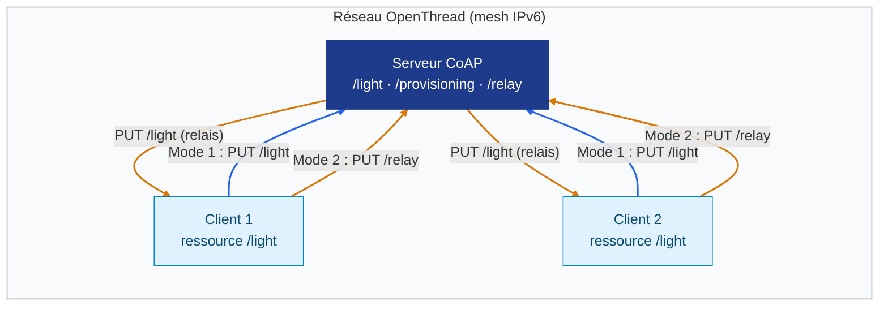
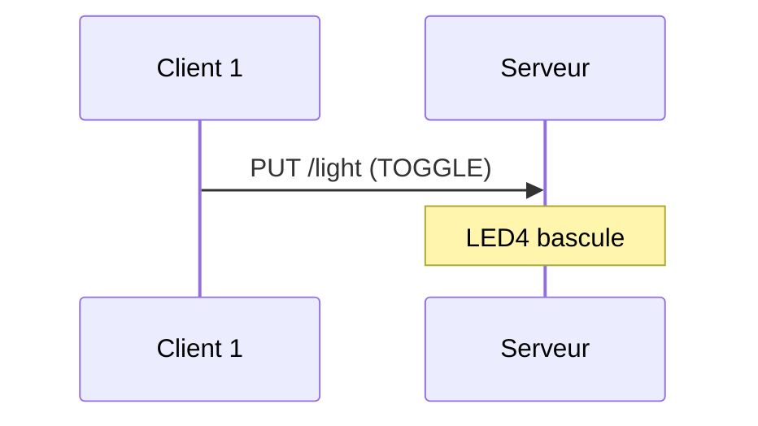
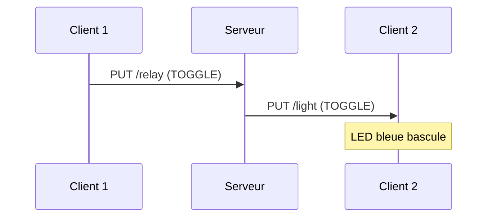

# Thread CoAP – Serveur + 2 clients avec mode relais

Projet basé sur les exemples **CoAP Server / CoAP Client** du nRF Connect SDK (Zephyr + OpenThread), modifié pour :

- faire fonctionner **un serveur CoAP** et **deux clients CoAP** sur un même réseau Thread ;
- piloter chaque client avec **un seul bouton** et **deux LEDs** ;
- proposer **deux modes** de commande :
  - **Mode 1 (SERVER)** : un client allume ou éteint la LED du **serveur** ;
  - **Mode 2 (RELAY)** : un client allume ou éteint la LED de **l'autre client**, en passant par le serveur.

---

## Sommaire

1. [Architecture](#architecture)
2. [Étape 1 – Création du réseau OpenThread](#étape-1--création-du-réseau-openthread)
3. [Étape 2 – Serveur CoAP et clients CoAP](#étape-2--serveur-coap-et-clients-coap)
4. [Les deux modes de fonctionnement](#les-deux-modes-de-fonctionnement)
5. [Boutons et LEDs](#boutons-et-leds)
6. [Structure du dépôt](#structure-du-dépôt)
7. [Compilation et flashage](#compilation-et-flashage)
8. [Scénario de démonstration](#scénario-de-démonstration)

---

## Architecture



| Carte | Rôle | Ressources CoAP exposées |
|---|---|---|
| Serveur | Reçoit les commandes, possède une LED « lumière », relaie les commandes entre clients | `/provisioning`, `/light`, `/relay` |
| Client 1 | Envoie des commandes, possède une LED « lumière » pilotée par le client 2 | `/light` |
| Client 2 | Envoie des commandes, possède une LED « lumière » pilotée par le client 1 | `/light` |

Tous les échanges utilisent des messages CoAP **non confirmables** (NON) sur le port CoAP standard (5683).

---

## Étape 1 – Création du réseau OpenThread

Les trois cartes utilisent la pile **OpenThread** intégrée au nRF Connect SDK. Le shell OpenThread est activé dans le `prj.conf` :

```conf
CONFIG_OPENTHREAD=y
CONFIG_OPENTHREAD_COAP=y
CONFIG_SHELL=y
CONFIG_OPENTHREAD_SHELL=y
# Même clé réseau pour le client et le serveur
CONFIG_OPENTHREAD_NETWORKKEY="00:11:22:33:44:55:66:77:88:99:aa:bb:cc:dd:ee:ff"
```

Le réseau a été créé **manuellement**, avec les commandes `ot` tapées dans le moniteur série de chaque carte (115200 bauds).

### 1.1 Création du réseau sur le serveur (Leader)

```
ot dataset init new          # génère un nouveau jeu de paramètres (canal, PAN ID, clé…)
ot dataset commit active     # enregistre ce dataset comme dataset actif
ot ifconfig up               # active l'interface radio IEEE 802.15.4
ot thread start              # démarre Thread
ot state                     # attendre quelques secondes -> "leader"
```

Récupérer ensuite le dataset complet au format hexadécimal, pour le recopier sur les clients :

```
ot dataset active -x
```

### 1.2 Connexion de chaque client au réseau

Sur **chaque client**, coller le dataset récupéré sur le serveur :

```
ot dataset set active <dataset_hex_du_serveur>
ot ifconfig up
ot thread start
ot state                     # attendre quelques secondes -> "child" (ou "router")
```

### 1.3 Vérification

```
ot state             # rôle de la carte : leader / router / child
ot ipaddr            # adresses IPv6 de la carte
ot neighbor table    # voisins Thread visibles
ot ping <ipv6>       # test de connectivité entre deux cartes
```

Le dataset actif est sauvegardé en mémoire flash : après un redémarrage, les cartes rejoignent automatiquement le réseau.

### 1.4 Détection de la connexion dans le code

À chaque changement de rôle Thread, le callback `on_thread_state_changed()` est appelé :

- rôle `CHILD`, `ROUTER` ou `LEADER` → la carte est **connectée** ;
- rôle `DETACHED` ou `DISABLED` → la carte est **déconnectée**.

### Visualisation de la connexion

| Carte | Indicateur de connexion Thread |
|---|---|
| Serveur | LED1 allumée fixe |
| Client | LED rouge allumée (fixe ou clignotante selon le mode) ; éteinte = pas connecté |

---

## Étape 2 – Serveur CoAP et clients CoAP

### 2.1 Serveur CoAP (`coap_server/`)

Au démarrage, `ot_coap_init()` enregistre trois ressources CoAP et lance le serveur sur le port 5683 :

| Ressource | Méthode | Rôle |
|---|---|---|
| `/provisioning` | `GET` (multicast) | Répond avec l'adresse **Mesh-Local EID** du serveur et **enregistre l'adresse du client** |
| `/light` | `PUT` | Commande la LED du serveur (`0` = OFF, `1` = ON, `2` = TOGGLE) |
| `/relay` | `PUT` | Retransmet la commande en `PUT /light` à **tous les clients enregistrés sauf l'émetteur** |

**Table des clients** : le serveur garde en mémoire jusqu'à **4 clients** (`MAX_CLIENTS`). Un client est ajouté lors du provisioning, ou lors de sa première requête `/relay` s'il n'est pas encore connu.

**Provisioning** : un appui sur le **bouton 4** du serveur ouvre une fenêtre de provisioning de **5 secondes** (LED3 clignote). Dès qu'un client a été appairé, la fenêtre se ferme : il faut donc **rappuyer sur le bouton 4 pour chaque client**.

### 2.2 Clients CoAP (`coap_client/`)

Chaque client joue deux rôles :

- **client CoAP** : il envoie des requêtes au serveur (`/provisioning`, `/light`, `/relay`) ;
- **petit serveur CoAP** : il expose sa propre ressource `/light`, pour que le serveur puisse lui transmettre les commandes relayées depuis l'autre client.

**Appairage (provisioning)** :

1. Sur le serveur, appuyer sur le bouton 4 (fenêtre de 5 s).
2. Sur le client, appuyer sur le bouton : il envoie un `GET /provisioning` en **multicast** (`ff03::1`).
3. Le serveur répond avec son adresse IPv6 et enregistre celle du client.
4. Le client mémorise l'adresse du serveur : il est maintenant **appairé**.

Répéter l'opération pour le second client.

---

## Les deux modes de fonctionnement

Une fois appairé, le bouton du client distingue **simple clic** et **double clic** (deux appuis en moins de 400 ms) :

| Action | Effet |
|---|---|
| Simple clic | Envoie la commande du mode actif |
| Double clic | Bascule entre le mode 1 et le mode 2 |

### Mode 1 – SERVER (LED rouge fixe)

Le client envoie `PUT /light` (TOGGLE) directement au serveur, ce qui bascule la **LED4 du serveur**.



### Mode 2 – RELAY (LED rouge clignotante)

Le client envoie `PUT /relay` (TOGGLE) au serveur. Le serveur identifie l'émetteur et renvoie un `PUT /light` à l'autre client, dont la **LED bleue** bascule.



Le fonctionnement est symétrique : le client 2 en mode 2 pilote la LED bleue du client 1.

---

## Boutons et LEDs

### Serveur

| Élément | Fonction |
|---|---|
| **Bouton 4** | Active le provisioning pendant 5 s |
| **LED1** | Connecté au réseau Thread |
| **LED3** | Clignote pendant la fenêtre de provisioning |
| **LED4** | « Lumière » du serveur (pilotée en mode 1) |

### Client

| Élément | Fonction |
|---|---|
| **Bouton 1** | Non appairé : provisioning · Simple clic : commande · Double clic : changement de mode |
| **LED rouge** (`DK_LED1`) | Éteinte : pas connecté · Fixe : mode 1 · Clignotante : mode 2 |
| **LED bleue** (`DK_LED2`) | « Lumière » du client (pilotée par l'autre client en mode 2) |

> Selon la carte, la LED rouge et la LED bleue peuvent être inversées : échanger `DK_LED1` et `DK_LED2` dans `coap_client/src/main.c` si nécessaire.

### Commandes BLE (optionnel, `CONFIG_BT_NUS`)

Si le Bluetooth NUS est activé sur le client, on peut envoyer un caractère depuis une application BLE (ex. nRF Toolbox) :

| Caractère | Action |
|---|---|
| `u` | Toggle unicast de la LED du serveur |
| `m` | ON/OFF en multicast de toutes les LEDs |
| `p` | Demande de provisioning |
| `r` | Toggle relayé vers l'autre client |

---

## Structure du dépôt

```
.
├── README.md
├── interface/
│   └── coap_server_client_interface.h   # URI partagées : light, provisioning, relay
├── coap_server/
│   ├── CMakeLists.txt
│   ├── prj.conf
│   └── src/
│       ├── main.c                        # boutons, LEDs, provisioning
│       ├── ot_coap_utils.c               # ressources /light, /provisioning, /relay
│       └── ot_coap_utils.h
└── coap_client/
    ├── CMakeLists.txt
    ├── prj.conf
    └── src/
        ├── main.c                        # bouton unique, simple/double clic, modes
        ├── coap_client_utils.c           # requêtes CoAP + ressource /light locale
        └── coap_client_utils.h
```

L'en-tête partagé doit définir la nouvelle URI du relais en plus des URI d'origine :

```c
#define RELAY_URI_PATH "relay"
```

---

## Compilation et flashage

Prérequis : nRF Connect SDK installé (`west`, toolchain), trois cartes nRF compatibles Thread (ex. nRF52840 DK).

```bash
# Serveur
cd coap_server
west build -b <votre_carte> -p
west flash --snr <numero_serie_carte_serveur>

# Client (à flasher sur les deux cartes clientes)
cd ../coap_client
west build -b <votre_carte> -p
west flash --snr <numero_serie_client_1>
west flash --snr <numero_serie_client_2>
```

Les logs sont visibles sur le port série de chaque carte (115200 bauds).

---

## Scénario de démonstration

1. Créer le réseau sur le **serveur** (`ot dataset init new` … `ot thread start`) → LED1 s'allume (Leader).
2. Connecter les **deux clients** (`ot dataset set active …` … `ot thread start`) → leur LED rouge s'allume (connectés, mode 1).
3. Serveur : **bouton 4** → Client 1 : **appui** → client 1 appairé.
4. Serveur : **bouton 4** → Client 2 : **appui** → client 2 appairé.
5. Client 1, **simple clic** → la LED4 du serveur bascule (mode 1).
6. Client 1, **double clic** → sa LED rouge clignote (mode 2).
7. Client 1, **simple clic** → la LED bleue du client 2 bascule.
8. Même chose depuis le client 2 vers le client 1.

---

## Licence

Code dérivé des exemples Nordic Semiconductor — `LicenseRef-Nordic-5-Clause`.
